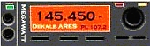
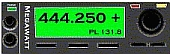

---
# 145 Repeater | 145.450 - PL 107.2 
# and
# 444 Repeater | 444.250 + PL 131.8

## History:
In late January of 2015, the old Micor 2-meter and 440 repeaters *and the cabinets associated with that equipment* were replaced with brand-new Kenwood commercial-grade repeater equipment. The new cabinet currently contains the 2-meter, 220, and 440 repeaters along with two 100 watt power amplifiers serving the 2-meter and 440 repeaters. The individual repeater controllers for the old 2-meter and 440 repeaters were replaced by a single SCOM 7330 repeater controller. The new equipment cabinet and the separate cabinet for the 2-meter duplexer were repositioned against the back wall; freeing up quite a bit of floor space at the location.

The new equipment cabinet also houses the Astron 50 Amp power supply and a 120 Ah AGM backup battery.

---

  

---
