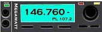

---
# Sponsored Nets
---

## On our flagship repeater:
> **Connect to this repeater over EchoLink!**    
> **Search for us by Call (W4BOC-R) or Node Number (330246).**

---

### [Brown Bag Lunch Bunch]()
> [brown-bag.net](https://www.brown-bag.net)   

Check the [.76 repeater](76repeater#76-repeater--146760---pl-1072) at noon ET weekdays (Monday - Friday).

> This informal net is held from 12 PM ET to 1 PM ET at least two days a week *(but not guaranteed the same two days :wink:)*   
>   
> Join this net for one-on-one ragchews and round-table discussions:
> * while at lunch :pizza:
> * on the way to lunch :car:
> * coming back from lunch :motorcycle:

---

### [Turnip Truck Net](turnip#preamble)
> [turnip-truck.net](https://www.turnip-truck.net)

Support your local Juice Company and come join the World Famous [Turnip Truck Net](turnip#preamble) on Saturday night at 10PM ET.

***We must caution you that once you have checked into this net you will be forever known as a “Turnip”.***

#### History:
> This net was originally founded by:
> * Emory May WN4DIZ (N4XVQ)/SK
> * Adam Mewherter WB3BTX/SK
> * Langdon "Mac" McAlpin N4PMG (PURPLE MOUNTAIN GOAT)/SK

#### __This Net Uses <a href="https://netlogger.org/" title="Netlogger" target="_blank" rel="noopener">Netlogger!</a>__
> Join us over-the-air __and__ on the Netlogger AIM (Almost Instant Messenger).
>
> Netlogger shows a list of stations that have already checked-in with Net Control and allows _group chat_ with other Netlogger users participating in the net.

#### __NCS and NLS Needed!__
> We are actively seeking Drivers and Loggers to serve as NCS/NLS for the Saturday Night [Turnip Truck Net](turnip#preamble).
>
> Add yourself to the <a title="Turnip Truck Net Schedule" href="{{ site.turnip_schedule }}" target="_blank" rel="noopener">Turnip Truck Net schedule</a> today.

---

### [Sunday Night Net](sunday#preamble)
A weekly net is held on Sunday evenings at 7PM ET to:
* practice our skills
* share club information
* have a buy/sell portion of the net

You do not have to be a member of the Alford Memorial Radio Club to participate.

#### __This Net Uses <a href="https://netlogger.org/" title="Netlogger" target="_blank" rel="noopener">Netlogger!</a>__     
> Join us over-the-air __and__ on the Netlogger AIM (Almost Instant Messenger).   
>   
> Netlogger shows a list of stations that have already checked-in with Net Control and allows _group chat_ with other Netlogger users participating in the net.

#### __NCS and NLS Needed!__   
> We are actively seeking stations to serve as NCS/NLS for the [Sunday Night Net](sunday#preamble).   
>   
> Sign up today by adding yourself to the <a title="Sunday Night Net" href="{{ site.sunday_schedule }}" target="_blank" rel="noopener">Sunday Night Net schedule</a>.

---   
---

## Tune in to the *.45* at [Exchange Park](repeaters#site-exchange-park) for:

---

### <a title="DeKalb ARES" href="{{ site.dekalbares_url }}/nets.html" target="_blank" rel="noopener">Dekalb ARES Weekly Training Net</a>
* *Sunday night at 20:00 ET*

> Go visit the <a title="DeKalb ARES" href="{{ site.dekalbares_url }}/nets.html" target="_blank" rel="noopener">DeKalb ARES</a> site for more information.

---
