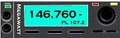
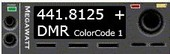
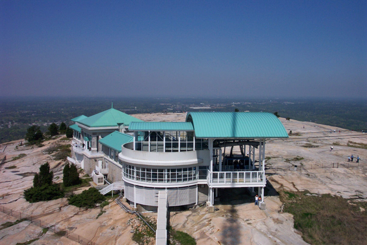
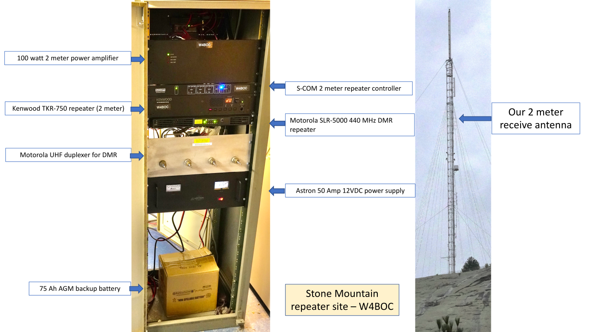
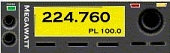
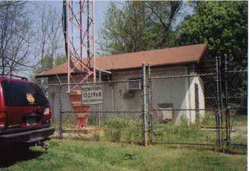
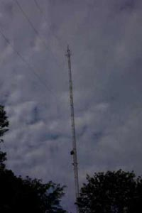
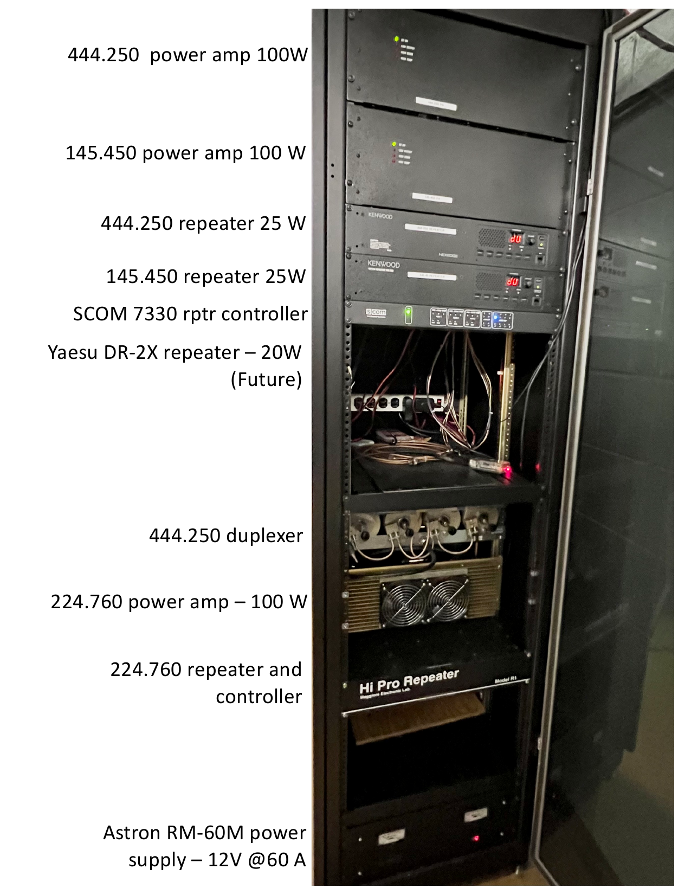

---
# Our Repeaters
The Alford Memorial Radio Club currently maintains repeaters at two sites; a primary site at the top of [Stone Mountain](#site-stone-mountain) in Stone Mountain, GA and a secondary site at [Exchange Park](#site-exchange-park) in Decatur, GA.

---
---

## Site: Stone Mountain

---

### Repeaters:
*Click the radio graphics below for more information*

---

### Location: Top of the Rock

 
<i>view from the tower (the 2 meter transmit antenna and the duplexed 440 DMR antenna are under the pyramid roof on top of the public observation building)</i>

---

### Site Equipment:

 
<i>cabinet layout and location of 2-meter receive antenna</i>

---
---

## Site: Exchange Park

---

### Repeaters:
*Click the radio graphics below for more information*

---

### Location: Near Exchange Park

---

### Site Equipment:

 
<i>view of the tower</i>

 
<i>repeater cabinet layout</i>

 
<i>repeater cabinet (left) and duplexer cabinet (right)</i>

---

  

---
