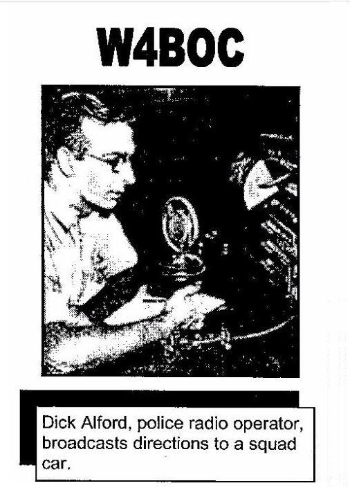

---
# Who was Dick Alford W4BOC?

The Alford Memorial Radio Club is dedicated to the memory of Richard Herrin "Dick" Alford, a well-known and respected Atlanta Ham who passed away on August 21, 1968. Dick was also a versatile Ham; he operated on CW, Phone, Teletype, and was a pioneer on 2-meter FM in the Atlanta area.

Born as Richard Herrin Alford on March 4, 1908 in Palatka, Florida, Dick Alford became an operator of the old Atlanta Police Radio Station WDPY starting in 1936.  Several years later, despite having an occupation exempt from the draft, he volunteered for duty in World War II and served as a lieutenant in the Signal Corps.   While working on a transmitter located on Green Island in the Pacific, Dick was severely wounded in a high-voltage accident and his family was told to expect the worst.  Despite the odds, he survived (albeit disabled) and was discharged with the rank of captain.   After returning home, he again went to work with the Atlanta Police Department but his previous injury and disablement later forced his retirement.   Dick then was then able to devote a great amount of time to his hobby; Amateur Radio.

One of his avid interests was helping new Hams "get started" and he was also, at one time, a Vice-Director of the ARRL.  

The Alford Memorial Radio Club was formed in 1973 with the _then_ primary purpose of building, installing, and maintaining an [amateur repeater](76repeater#76-repeater--146760---pl-1072) for Atlanta, Georgia.

It is with great pleasure that we take this opportunity to honor Dick Alford, a Ham whose example of friendship and helpfulness will occupy a warm place (we hope) within the memory of all Atlanta-area Hams.

---
